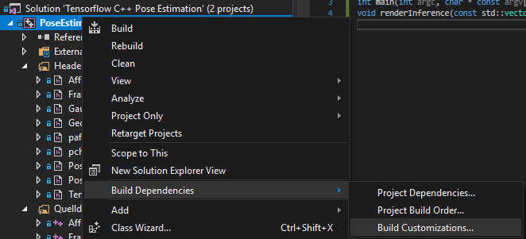
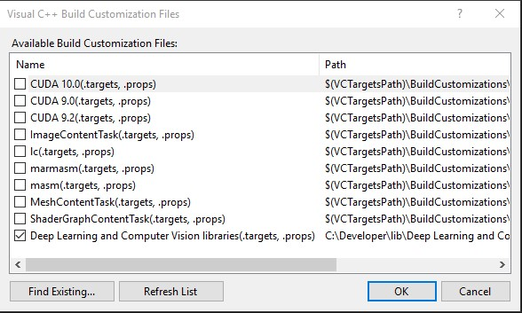

# Deep learning libs

Contains MSBuild targets and build scripts for the libraries I use. Projects may simply include the Visual Studio Build customisation file `Deep Learning and Computer Vision libraries.targets` to reference those libraries from Visual Studio projects.



The customisation file defines include and library paths, and automatically selects the library version that corresponds to the project's platform toolset.




## Preparing libraries
Adding the build customisation file to a project automatically enables access to the supported libraries. These are currently:

1. OpenCV: Platform toolset is automatically selected, OpenCV release contains binaries for VC14 and vc15
2. TensorFlow: To be build manually (see below). Selection of platform toolset and cpu/gpu build configuration.
3. dlib C++ toolkit

### OpenCV
Download OpenCV 4.0.1 into the lib directory and rename the folder to "OpenCV 4.0.1".


### Building Tensorflow 1.10 with CMake and Visual Studio 2017

1. Install Visual Studio 2017 Community Edition, Python 3.66, Git, Cuda 10

2. Enable long filenames for Git, otherwise you'll might not get very far:
```
git config --system core.longpaths true
```    

3. Enable long filenames in Windows 10 for the same reason : 
    - https://www.howtogeek.com/266621/how-to-make-windows-10-accept-file-paths-over-260-characters/ 
    - https://docs.microsoft.com/en-us/windows/desktop/fileio/naming-a-file

Currently, only TensorFlow r1.10 is supported, for a couple of reasons:

1. It is the last version that that officially supports CUDA Compute Caps 3.5, and therefore runs with my slightly outdated 2013 GPU (NVidia Titan).
2. The cmake build supports Cuda 10.
3. The bazel Windows build  (as of tf r1.10) has lots of issues.
4. Builds with Visual Studio 2017 after applying two patches.
5. Debug build is fully supported - won't work with Bazel build either.

Open a Visual Studio 2017 x64 command prompt and execute the build script that matches your hardware configuration
```
build_tensorflow_r1.10-cmake-cpu.bat
build_tensorflow_r1.10-cmake-cuda.bat
```
The script clones TensorFlow r.1.10 branch, applies patches to enable building with Visual Studio 2017, creates Visual Studio solutions via CMake, and then invokes MSBuild to build targets for several CPU/GPU configurations. The build should take about half a day or so and leaves you with a couple of TensorFlow dlls in `lib\tensorflow\r1.10\vc15` for Debug, avx, avx2, cuda, cuda-avx & avx2-fma configurations.

You can build a single configuration with `build_tensorflow_with_cmake.bat "VS Configuration"`, for instance
```
build_tensorflow_with_cmake.bat Debug
```

The special fma build will be included into the avx2 build later on, but I'm interested in the performance gain - we'll see about that later.
 
There's no /GL build yet because it exceeds the 4G size limit of the COFF file format.

The cpu/gpu arch is simply matched via the configuration name, so the project references Debug/Release (both built with AVX) automatically. To match a build configuration, just name it after the folder that contains the specific version of Tensorflow. (For instance `Release-cuda-avx2`)


### Running the test project "Hello Tensorflow"
A hello-world example derived from https://joe-antognini.github.io/machine-learning/windows-tf-project, plus a Google test suite to assert that the library works.

When you build and run the Hello-Word example, the console should display the expected result
```
 7 17
-1 -3
```
